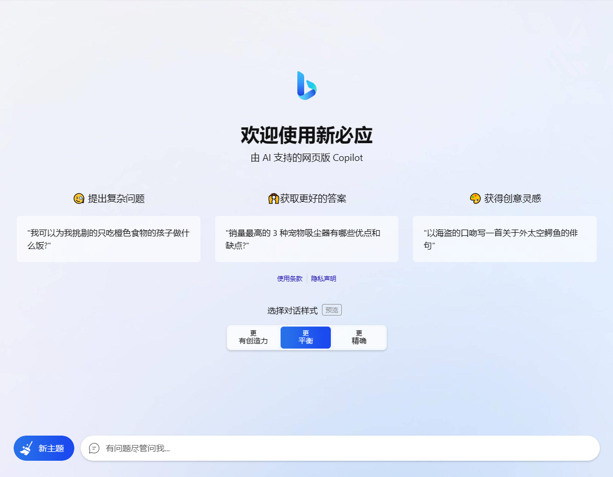
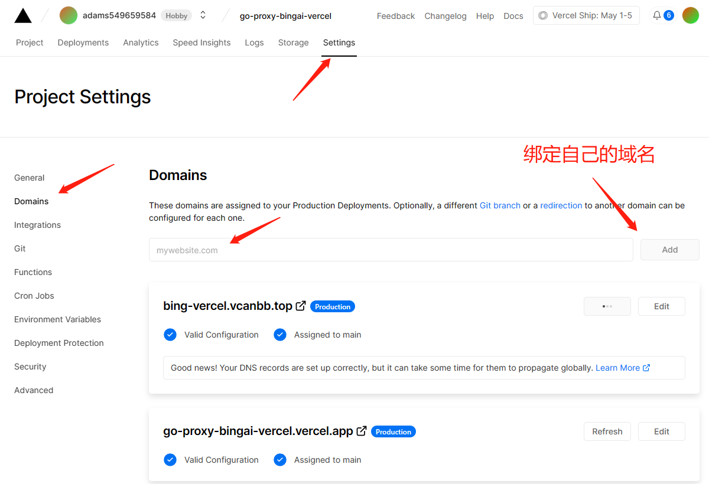

# go-proxy-bing

一个用 GO 写的微软 Bing AI 的代理服务。 使用微软原始页面简单定制，基本兼容微软 Bing AI 所有功能，无需登录即可畅聊。

⭐ 国内可用

⭐ 无需登录即可畅聊

⭐ 需要画图等高级功能时，可登录微软账号设置用户Cookie进行体验

⭐ 遇到一切问题，可使用刷新大法，比如（24小时限制、未登录提示等等）

- [go-proxy-bing](#go-proxy-bing)
	- [演示站点](#演示站点)
	- [获取Cookie](#获取Cookie)
	- [部署](#部署)
		- [Docker](#Docker)
		- [Release](#Release)
		- [Railway](#Railway)
		- [Vercel](#Vercel)
    
- 电脑端未登录状态



- 电脑端登录


- 电脑端画图


- 手机端未登录状态


## 演示站点

### 甲骨文小鸡仔，轻虐

- https://bing.vcanbb.top

### Railway搭建

- https://bing-railway.vcanbb.top

- https://go-proxy-bingai-production.up.railway.app

### Vercel搭建

- https://bing-vercel.vcanbb.top

- https://go-proxy-bingai-vercel.vercel.app

## 获取Cookie

- 访问 https://www.bing.com/ 或 https://cn.bing.com/ ，登录

- F12 或 Ctrl + Shift + I 打开控制台

- 拿到 Cookie 后，在网站设置用户Cookie弹窗填入即可。


## 部署

> 需 https 域名 (自行配置 nginx 等)

> 支持 Linux (amd64 / arm64)

### Docker

> 参考 [Dockerfile](./docker/Dockerfile) 、[docker-compose.yml](./docker/docker-compose.yml)

示例

```bash
# 运行容器 监听8080 端口
docker run -d -p 8080:8080 --name go-proxy-bingai --restart=unless-stopped adams549659584/go-proxy-bingai
```

### Release

在 [Github Releases](https://github.com/adams549659584/go-proxy-bingai/releases) 下载适用于对应平台的压缩包，解压后可得到可执行文件 go-proxy-bingai，直接运行即可。

### Railway

> 主要配置 Dockerfile 路径 及 端口就可以

```bash
PORT=8080
RAILWAY_DOCKERFILE_PATH=docker/Dockerfile
```
一键部署，点这里 =>  [](https://railway.app/template/uIckWS?referralCode=BBs747) 


自行使用 Railway 部署配置如下


### Vercel

一键部署，点这里 => [](https://vercel.com/new/clone?repository-url=https://github.com/adams549659584/go-proxy-bingai&project-name=go-proxy-bingai&repository-name=go-proxy-bingai-vercel)


